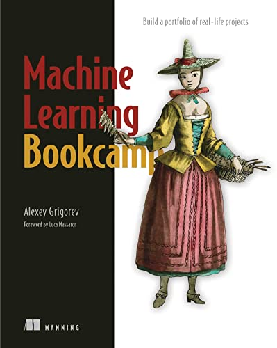
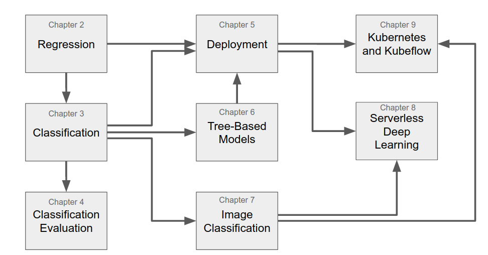

# machine-learning-bookcamp-build-a-portfolio-of-real-life-projects

Python机器学习项目实战

# 作者推荐的阅读顺序

每个章节的标题，内容和我的代码实现。

| 编 号 | 章节                 | 内容                                                         | 我的实现                                                     | 完成情况 |
| ----- | -------------------- | ------------------------------------------------------------ | ------------------------------------------------------------ | -------- |
| 1     | 机器学习简介         | 理解机器学习及其可解决的问题                                 | [机器学习简介](https://github.com/YeJiu97/machine-learning-bookcamp-build-a-portfolio-of-real-life-projects/tree/main/scr/chapter%2301%EF%BC%9A%E6%9C%BA%E5%99%A8%E5%AD%A6%E4%B9%A0%E7%AE%80%E4%BB%8B) | 完成     |
| 2     | 回归问题的机器学习   | 使用线性回归模型创建汽车价格预测项目                         | [用于回归的机器学习](https://github.com/YeJiu97/machine-learning-bookcamp-build-a-portfolio-of-real-life-projects/tree/main/scr/chapter%2302%EF%BC%9A%E7%94%A8%E4%BA%8E%E5%9B%9E%E5%BD%92%E7%9A%84%E6%9C%BA%E5%99%A8%E5%AD%A6%E4%B9%A0) | 完成     |
| 3     | 分类问题的机器学习   | 使用逻辑回归预测客户是否流失                                 | [用于分类的机器学习](https://github.com/YeJiu97/machine-learning-bookcamp-build-a-portfolio-of-real-life-projects/tree/main/scr) | 完成     |
| 4     | 分类问题的评估指标   | 使用准确率、混淆矩阵、精确率、召回率、ROC、AUC等评估分类模型 | [分类的评估标准](https://github.com/YeJiu97/machine-learning-bookcamp-build-a-portfolio-of-real-life-projects/tree/main/scr/chapter%2304%EF%BC%9A%E5%88%86%E7%B1%BB%E7%9A%84%E8%AF%84%E4%BC%B0%E6%8C%87%E6%A0%87) | 完成     |
| 5     | 机器学习模型的部署   | 使用Pickle保存模型、Flask部署模型、Pipenv管理依赖、Docker打包服务、AWS Elastic Beanstalk部署到云端 | [机器学习的模型的部署](https://github.com/YeJiu97/machine-learning-bookcamp-build-a-portfolio-of-real-life-projects/tree/main/scr/chapter%2305%EF%BC%9A%E6%9C%BA%E5%99%A8%E5%AD%A6%E4%B9%A0%E6%A8%A1%E5%9E%8B%E9%83%A8%E7%BD%B2) | 基本完成 |
| 6     | 决策树与集成学习     | 使用树模型预测违约风险，包括决策树、随机森林、梯度提升树等   | [决策树与集成学习](https://github.com/YeJiu97/machine-learning-bookcamp-build-a-portfolio-of-real-life-projects/tree/main/scr/chapter%2306%EF%BC%9A%E5%86%B3%E7%AD%96%E6%A0%91%E4%B8%8E%E9%9B%86%E6%88%90%E5%AD%A6%E4%B9%A0) | 完成     |
| 7     | 神经网络与深度学习   | 使用卷积神经网络进行图像分类，介绍TensorFlow和Keras，迁移学习、数据增强等 | [神经网络学习](https://github.com/YeJiu97/machine-learning-bookcamp-build-a-portfolio-of-real-life-projects/tree/main/scr/chapter%2307%EF%BC%9A%E7%A5%9E%E7%BB%8F%E7%BD%91%E7%BB%9C%E4%B8%8E%E6%B7%B1%E5%BA%A6%E5%AD%A6%E4%B9%A0) | 完成     |
| 8     | 无服务器深度学习     | 使用TensorFlow-Lite提供轻量级环境，使用AWS Lambda部署深度学习模型，通过API Gateway提供网络服务 | [无服务器深度学习](https://github.com/YeJiu97/machine-learning-bookcamp-build-a-portfolio-of-real-life-projects/tree/main/scr/chapter%2308%EF%BC%9A%E6%97%A0%E6%9C%8D%E5%8A%A1%E5%99%A8%E6%B7%B1%E5%BA%A6%E5%AD%A6%E4%B9%A0) | 完成     |
| 9     | Kubernetes与Kubeflow | 使用Kubernetes部署和服务模型，使用Kubeflow简化部署流程       | [Kubeflow](https://github.com/YeJiu97/machine-learning-bookcamp-build-a-portfolio-of-real-life-projects/tree/main/scr/chapter%2309%EF%BC%9Akubeflow)，[kubernetes](https://github.com/YeJiu97/machine-learning-bookcamp-build-a-portfolio-of-real-life-projects/tree/main/scr/chapter%2309%EF%BC%9Akubernetes) | 完成     |
| 10    | 附录                 | Python，NumPy和Pandas                                        | [附录](https://github.com/YeJiu97/machine-learning-bookcamp-build-a-portfolio-of-real-life-projects/tree/main/scr/chapter%2310%EF%BC%9A%E9%99%84%E5%BD%95) | 完成     |

# 书籍评价

书籍的评价：⭐⭐⭐⭐/⭐⭐⭐⭐⭐

从内容的角度来看，其实是一本比较好的机器学习的入门书籍，并且不是单纯的将理论，而是从某一个具体的数据集和对应的项目来阐述了对应的算法，仅少量的数学，大量的图表和说明，这一点相对于其他的中文机器学习的教程书籍来的好很多。但是这本书籍缺少了关于无监督学习相关的内容，如果仅讨论有的监督学习，书籍也缺乏了关于SVM和朴素贝叶斯算法等内容。

另外，这本书中有着三个章节是关于服务器部署等相关的内容的，虽然这可以视作是“实战”，但是对于冲着机器学习项目实战而来的人，更好的选择是将这些讲解替换成SVM和朴素贝叶斯，然后再最后的章节给出如何导出模型，载入模型，部署模型和服务器上使用模型的内容。而且不是所有的读者都会使用亚马逊服务器或者某一个特定的服务器的，不如去除掉在某一个具体的服务器上部署的想法，而是更加具体的而讲一下如何使用本地的Flask来进行模型使用，虽然现在也有Flask相关的内容，但是内容太短了。

不是关于模型的章节部分我大部分都是自己看过去和简单的对着敲了一下代码，这个库中的对应章节的内容主要还是来自作者自己的代码。注意：作者的jupyter中只有代码，基本没有注释，很少有讲解，这个相对于Python数据科学项目实战来的查了太多，那本书的jupyter源代码基本上就是书籍的内容，有着完整的讲解和代码实现和对代码的结果的解释，可以说就是书籍的内容的jupyterlab排版。

如果是我的话，我应该会给出这样的内容结构：

- 第一章：机器学习简介和环境搭建
- 第二章：回归分析，线性回归和非线性回归
- 第三章：分类问题，二元分类和评估
- 第四章：分类问题，多元分类和评估
- 第五章：贝叶斯分类
- 第六章：决策树与随机森林
- 第七章：SVM
- 第八章：深度学习：实现一下MNIST的识别
- 第九章：模型导入，导出，如何应用到新的数据集和如何使用Flask进行部署
- 附录：Python基础语法，numpy基础语法，pandas基础语法，一些推荐的Kaggle项目

这本书的标价是129，只比另一本书的139便宜了10块钱，但是薄了许多，内容的硬核程度和随书源代码也都差了很多，拼多多的价格为55上下，性价比还行。

补充：书中的代码存在着一些问题，一些代码的缩进和符号存在着错误或者确实；另外主要是第7章，也就是深度学习的部分，如果对着书走，敲的代码的运行结果和书籍给出来的运行结果是对不上的，因为书中的代码和作者的源代码存在着出入。

